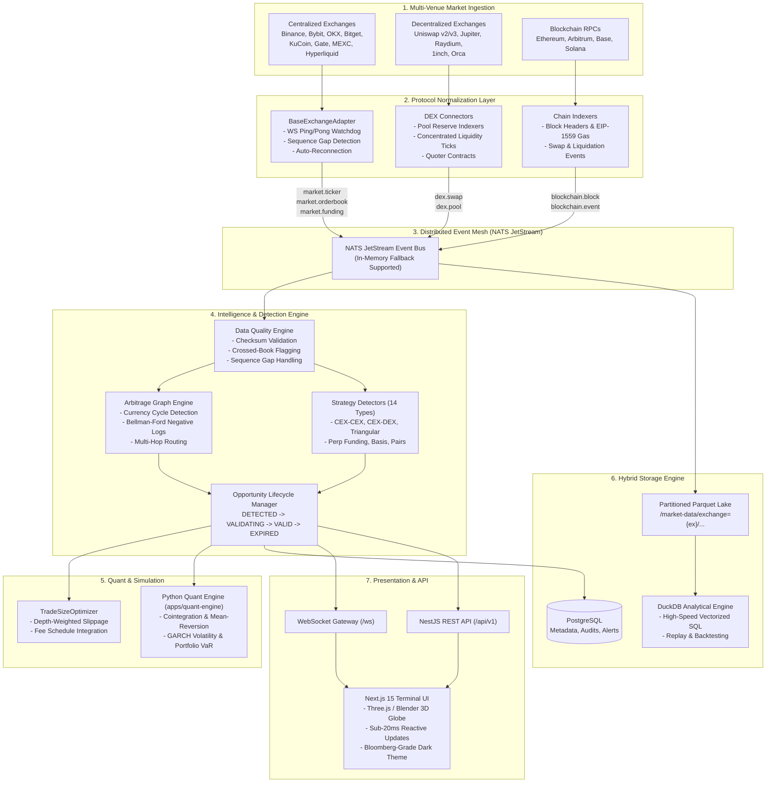

# ArbNexus System Architecture Overview

## 1. Mission & System Philosophy

**ArbNexus** is an institutional-grade, real-time cryptocurrency arbitrage intelligence and market discovery platform. Its purpose is to continuously ingest, normalize, analyze, and simulate multi-venue arbitrage opportunities across Centralized Exchanges (CEXs), Decentralized Exchanges (DEXs), and multi-chain liquidity pools.

### Safety & Operational Boundaries

```
+-------------------------------------------------------------------------------+
|                             STRICT SAFETY BOUNDARIES                          |
+-------------------------------------------------------------------------------+
|  1. INTELLIGENCE ONLY    - Real trade execution is strictly disabled.         |
|  2. ZERO KEY EXPOSURE    - Private keys & trading secrets are never requested |
|                            or loaded into frontend code.                      |
|  3. DETERMINISTIC MATH   - Financial calculations rely 100% on Decimal.js     |
|                            and are mathematically isolated from heuristics.   |
|  4. MODE TRANSPARENCY    - Every data point and UI component explicitly      |
|                            states its mode: LIVE, DEMO, REPLAY, or BACKTEST.  |
+-------------------------------------------------------------------------------+
```

---

## 2. High-Level System Architecture

The ArbNexus system is designed around an event-driven, decoupled reactive microkernel pattern:



---

## 3. Polyglot Monorepo Structure

ArbNexus utilizes a polyglot monorepo orchestrated via `pnpm` workspaces and `turbo`:

```
d:/Crypto Arbitrage/
├── apps/
│   ├── api/                   # NestJS Backend API, WebSocket Gateways, Swagger
│   ├── web/                   # Next.js 15 Terminal UI with Three.js / Blender scene
│   ├── data-engine/           # Real-time WebSocket ingestion workers & normalizers
│   ├── quant-engine/          # Python 3.14 quant engine (FastAPI, Polars, DuckDB, SciPy)
│   └── indexer/               # Multi-chain EVM & Solana event indexers
├── packages/
│   ├── market-data/           # Canonical schemas, OrderBookManager, SymbolNormalizer
│   ├── exchange-connectors/   # CEX adapters (Binance, Bybit, OKX, Hyperliquid, etc.)
│   ├── dex-connectors/        # DEX adapters (Uniswap, Jupiter, 1inch, Raydium, Orca)
│   ├── arbitrage-engine/      # 14 strategy detectors, Opportunity lifecycle
│   ├── graph-engine/          # Currency graph cycle search & multi-hop routing
│   ├── data-quality/          # Validation, crossed book detection, latency tracking
│   ├── backtesting/           # Event-driven backtesting & historical replay
│   ├── calculators/           # Deterministic Decimal.js financial calculators
│   ├── quant/                 # TypeScript mathematical statistics & rolling windows
│   ├── risk/                  # Pre-trade risk filters, concentration limits
│   ├── optimization/          # Capital allocation & trade size optimization
│   ├── protocols/             # Constant product & concentrated liquidity AMM math
│   ├── blockchain/            # Multi-chain RPC clients & gas price oracles
│   ├── types/                 # Shared domain types & interfaces
│   ├── config/                # Centralized configuration & environment schemas
│   ├── logger/                # Structured Pino logger with trace correlation
│   └── ui/                    # Reusable shadcn/ui components & design primitives
├── infrastructure/
│   ├── docker/                # Production container definitions
│   ├── monitoring/            # Prometheus scrape configs & Grafana dashboards
│   └── docker-compose.yml     # Local orchestration stack
├── docs/                      # Architectural specifications & runbooks
└── scripts/                   # Acceptance demonstration & verification tooling
```

---

## 4. Latency Pipeline Architecture

Every tick, orderbook delta, and opportunity carries high-resolution latency timestamps to measure processing overhead across every pipeline stage:

$$\text{Total Latency} = \text{Source Latency} + \text{Pipeline Latency} + \text{Detection Latency}$$

Where:

- **Source Latency**: $T_{\text{ingest}} - T_{\text{exchange}}$ (measures exchange clock drift, network hop, and gateway delay).
- **Pipeline Latency**: $T_{\text{normalize}} - T_{\text{ingest}}$ (measures serialization, schema validation, and bus transit).
- **Detection Latency**: $T_{\text{opportunity}} - T_{\text{normalize}}$ (measures graph search, orderbook execution simulation, and fee subtraction).

Target latencies:

- Internal pipeline transit: **$< 5\text{ ms}$**.
- Orderbook execution simulation ($100\text{k}$ depth walk): **$< 1\text{ ms}$**.
- Full end-to-end detection from raw WebSocket message: **$< 20\text{ ms}$**.
