# Event-Driven Backtesting & Market Replay Engine

## 1. Backtesting Architecture

The `@arbitrage/backtesting` package provides an institutional-grade, event-driven backtesting and market replay framework. Unlike naive vectorized backtests that assume instantaneous execution at midpoint prices, ArbNexus enforces:

1. **Strict Temporal Causality**: Events are replayed in exact chronological sequence according to `timestamp_exchange`.
2. **Realistic Fill Simulation**: Orders interact with historical L2 orderbook depth, incurring realistic depth-weighted price slippage.
3. **Fee & Latency Drag**: Configured maker/taker fees, gas fees, and simulated network transmission delays are factored into every simulated fill.
4. **Zero Lookahead Bias**: Detector logic only accesses information available up to the current simulation timestamp $t$.

```mermaid
flowchart LR
    Parquet[(Historical Parquet Lake)] --> Replay[Market Data Replay Engine]
    Replay -->|Ordered Tick Stream| Engine[Event-Driven Backtest Simulator]
    Engine --> Strategy[Arbitrage Detector Logic]
    Strategy -->|Simulated Orders| Matching[OrderBook Matching Engine]
    Matching -->|Fills & Slippage| Portfolio[Simulated Portfolio & Ledger]
    Portfolio --> Stats[Performance & Risk Analytics]
```



---

## 2. Configuration & Parameter Schema

```typescript
export interface BacktestConfig {
  id: string;
  strategyType: StrategyType;
  symbols: string[];
  venues: string[];
  startDate: string; // ISO 8601
  endDate: string; // ISO 8601
  initialCapitalUsd: number;
  simulatedLatencyMs: number; // Simulated network + calculation lag (e.g. 25ms)
  takerFeeBps: number;
  makerFeeBps: number;
  maxCapitalPerTradeUsd: number;
  slippageModel: 'ZERO' | 'LINEAR' | 'ORDERBOOK_DEPTH';
}
```

---

## 3. Performance Metrics Evaluated

The simulator computes standard quantitative risk and return metrics:

- **Net Profit ($)**: Total realized PnL after all fees and slippage.
- **ROI (%)**: $\frac{\text{Net Profit}}{\text{Initial Capital}} \times 100$.
- **Win Rate (%)**: $\frac{\text{Winning Trades}}{\text{Total Trades}} \times 100$.
- **Profit Factor**: $\frac{\sum \text{Gross Profits}}{\sum \text{Gross Losses}}$.
- **Sharpe Ratio**:
  $$\text{Sharpe} = \frac{\mathbb{E}[R_p - R_f]}{\sigma_p} \times \sqrt{365 \times 24}$$
- **Sortino Ratio**:
  $$\text{Sortino} = \frac{\mathbb{E}[R_p - R_f]}{\sigma_{\text{downside}}} \times \sqrt{365 \times 24}$$
- **Maximum Drawdown (MDD %)**:
  $$\text{MDD} = \max_{\tau \in [0, t]} \left(\frac{\text{Peak}_\tau - \text{Equity}_t}{\text{Peak}_\tau}\right) \times 100$$
- **Average Trade Duration**: Mean holding period in seconds.
- **Total Fee Drag ($)**: Cumulative trading, withdrawal, and gas fees paid.
