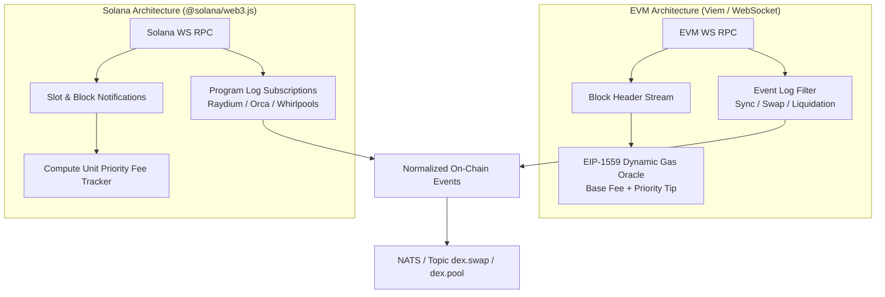

# Blockchain Indexers & MEV Simulation

## 1. Multi-Chain Indexing Architecture

The `apps/indexer` and `packages/blockchain` modules provide real-time blockchain telemetry, event filtering, and gas pricing for EVM networks (Ethereum, Arbitrum, Base, Optimism) and Solana:

---

## 2. Gas & Priority Fee Oracles

Accurate transaction cost estimation is vital because on-chain arbitrage opportunities evaporate if gas costs exceed gross profit:

### 2.1 EVM EIP-1559 Dynamic Pricing

The total gas price in Gwei is modeled as:

$$\text{Gas Price} = \text{Base Fee} + \text{Priority Fee (Tip)}$$

Transaction Cost in USD:

$$\text{Cost}_{\text{USD}} = \left(\text{Gas Used} \times \text{Gas Price} \times 10^{-9}\right) \times P_{\text{ETH}}$$

On Layer-2 rollups (e.g. Arbitrum, Base), the L1 data posting cost (blob fee / calldata compression) is added to the execution fee.

### 2.2 Solana Compute Units & Priority Fees

Solana transaction fees depend on requested compute units (CU):

$$\text{Fee}_{\text{lamports}} = 5{,}000 + \left(\frac{\text{MicroLamports Per CU} \times \text{Compute Units}}{10^6}\right)$$

---

## 3. MEV Simulation & Attack Surface Intelligence

ArbNexus monitors public mempools and block proposals to model MEV exposure and detect competitive opportunities:

1. **Sandwich Attack Vulnerability Scoring**:
   - Analyzes pending swaps in the mempool for high slippage tolerance ($\ge 1.0\%$).
   - Computes maximum extractable frontrun amount $\Delta x_{\text{front}}$ without causing the target trade to revert.
   - Calculates the risk score for our simulated trades to prevent sandwich exposure.

2. **Atomic Backrun Simulation**:
   - Detects large price-displacing trades.
   - Models the instantaneous arbitrage spread created between the displaced pool and secondary venues.
   - Simulates single-bundle backrun profitability before private builder submission.
