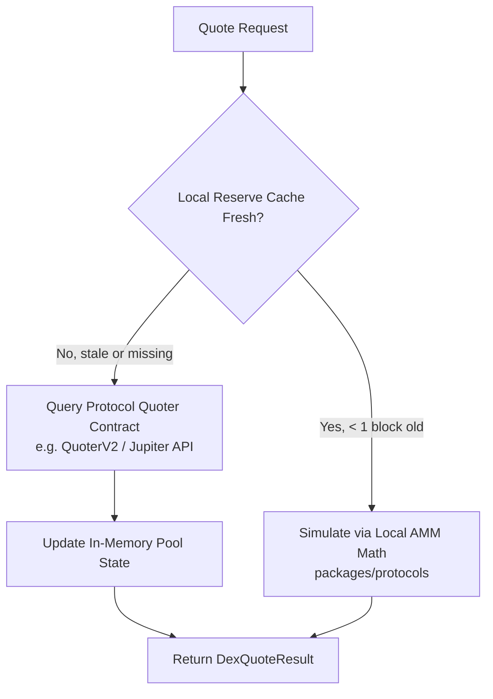

# Decentralized Exchange (DEX) Connectors

## 1. Overview & Protocol Abstraction

The `@arbitrage/dex-connectors` package provides unified interfaces to monitor on-chain liquidity pools, quote exact swap outputs, and detect CEX-DEX and DEX-DEX price discrepancies across EVM chains and Solana.

Supported Protocols:

- **Uniswap v2**: Standard constant product pools ($x \cdot y = k$) on Ethereum, Arbitrum, Optimism, and Base.
- **Uniswap v3**: Concentrated liquidity pools with tick range indexing and tick bitmaps.
- **Jupiter**: Aggregated routing on Solana across dynamic AMMs and orderbooks.
- **Raydium**: Hybrid AMM and OpenBook CLOB liquidity on Solana.
- **1inch**: Multi-chain aggregation protocol for optimized split-routing discovery.
- **Orca (Whirlpools)**: Concentrated liquidity on Solana.

---

## 2. DEX Connector Interface

```typescript
export interface DexQuoteRequest {
  dex: string;
  chain: string;
  tokenIn: string;
  tokenOut: string;
  amountIn: string; // Exact input amount (in base units or string)
  slippageToleranceBps: number;
}

export interface DexQuoteResult {
  dex: string;
  chain: string;
  tokenIn: string;
  tokenOut: string;
  amountIn: string;
  amountOut: string; // Expected output amount
  effectivePrice: string;
  priceImpactBps: number;
  estimatedGasCostUsd: string;
  routeSteps: string[];
  executionRisk: string;
}

export interface IDexConnector {
  getQuote(request: DexQuoteRequest): Promise<DexQuoteResult>;
  getPoolReserves(poolAddress: string): Promise<PoolReserves>;
  subscribePoolUpdates(poolAddress: string, cb: (reserves: PoolReserves) => void): void;
}
```

---

## 3. Quoting Strategy: On-Chain vs Local Math

To achieve sub-20ms latency while minimizing RPC load, ArbNexus uses a hybrid quoting mechanism:



1. **Local Analytical Simulation**:
   - For Uniswap v2: Computed in $< 0.1\text{ ms}$ via closed-form constant product formula with fee deduction.
   - For Uniswap v3: Evaluated locally across cached initialized tick arrays.
2. **On-Chain RPC Verification**:
   - Used periodically or when a lucrative arbitrage opportunity is flagged to confirm the quote against current block state.
