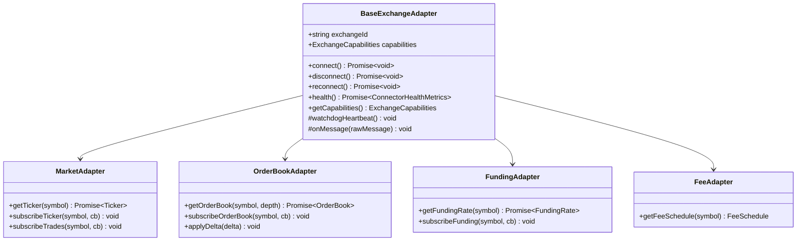

# Centralized Exchange (CEX) Connectors

## 1. Unified Connector Architecture

The `@arbitrage/exchange-connectors` package provides a modular, fault-tolerant interface for integrating centralized exchanges. All exchange implementations extend `BaseExchangeAdapter`, which enforces uniform life-cycle management, connection health monitoring, ping/pong heartbeats, and automated reconnection:

---

## 2. Implemented Venue Adapters

| Exchange        | WebSocket URL                           | Protocol  | Native Symbol Example | Canonical Symbol | Default Maker/Taker |
| :-------------- | :-------------------------------------- | :-------- | :-------------------- | :--------------- | :------------------ |
| **Binance**     | `wss://stream.binance.com:9443/ws`      | Raw JSON  | `BTCUSDT`             | `BTC/USDT`       | 10 bps / 10 bps     |
| **Bybit**       | `wss://stream.bybit.com/v5/public/spot` | JSON RPC  | `BTCUSDT`             | `BTC/USDT`       | 10 bps / 20 bps     |
| **OKX**         | `wss://ws.okx.com:8443/ws/v5/public`    | JSON RPC  | `BTC-USDT`            | `BTC/USDT`       | 8 bps / 15 bps      |
| **Bitget**      | `wss://ws.bitget.com/v2/ws/public`      | JSON RPC  | `BTCUSDT_UMCBL`       | `BTC/USDT`       | 10 bps / 20 bps     |
| **KuCoin**      | Bullet WS Gateway                       | Push JSON | `BTC-USDT`            | `BTC/USDT`       | 10 bps / 20 bps     |
| **Gate**        | `wss://api.gateio.ws/ws/v4/`            | JSON RPC  | `BTC_USDT`            | `BTC/USDT`       | 15 bps / 20 bps     |
| **MEXC**        | `wss://wbs.mexc.com/ws`                 | Push JSON | `BTCUSDT`             | `BTC/USDT`       | 0 bps / 10 bps      |
| **Hyperliquid** | `wss://api.hyperliquid.xyz/ws`          | JSON RPC  | `BTC` (Perp)          | `BTC/USDC`       | 1 bps / 3.5 bps     |

---

## 3. Resilience & Reconnection Pipeline

Each connector implements an automated 4-stage resilience loop:

1. **Ping/Pong Heartbeat Watchdog**:
   - Sends a venue-specific heartbeat frame (e.g. `{"op":"ping"}` or `{"method":"ping"}`) every 15–30 seconds.
   - If no pong or data message is received within `timeoutMs` (default: 10,000 ms), the connection is marked `STALE` and the socket is forcibly terminated.

2. **Exponential Backoff Reconnection**:
   - Initial retry delay: $500\text{ ms}$.
   - Multiplier: $1.5\times$ with jitter ($0\text{ to }250\text{ ms}$).
   - Maximum backoff cap: $30,000\text{ ms}$.
   - Max attempts: Configurable (default: unlimited with circuit breaker after 20 consecutive failures).

3. **Automatic Subscription Resumption**:
   - The connector maintains an active subscription registry. Upon reconnection, all registered ticker, depth, and funding streams are automatically resubscribed.

4. **REST Fallback on Desync**:
   - When orderbook sequence gaps or CRC32 checksum mismatches occur, the connector marks the orderbook `RESYNCING`, queries the REST snapshot endpoint, and replays buffered updates until state parity is restored.
